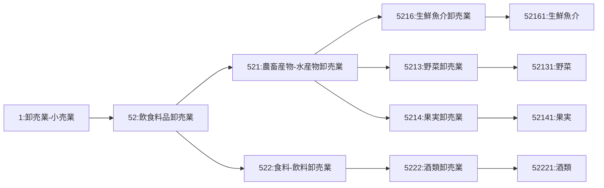

# -project-CompanyProfile
TG GLOBALの会社概要です

# TG GLOBAL可視化プロジェクト
この資料は、いつでも、誰でも、どこでもTG GLOBALを説明できるようにするための資料です。

## 会社概要資料
「会社概要」などは、Notionの社内ドキュメントにあります。
https://www.notion.so/tg-global/11fa0507655d47bba56c921fa0c272b6

## e-Statの産業分類コード
株式会社TG GLOBALの産業分類コードです。

https://www.e-stat.go.jp/classifications/terms/10

ハローワークも見やすい
https://www.hellowork.mhlw.go.jp/info/industry_list03.html#bunrui_top_52

以下、詳細です。
- 産業分類コード一覧（大分類1）：卸売業・小売業 WHOLESALE TRADE, GENERAL MERCHANDISE
  - 卸売業とは、主として次の業務を行う事業所をいいます。
(1) 小売業又は他の卸売業に商品を販売するもの
(2) 建設業、製造業、運輸業、飲食店、宿泊業、病院、学校、官公庁等の産業用使用者に商品を大量又は多額に販売するもの
(3) 主として業務用に使用される商品｛事務用機械及び家具、病院・美容院・レストラン・ホテルなどの設備、産業用機械（農業用器具を除く）、建設材料（木材、セメント、板 ガラス、かわらなど）など｝を販売するもの
(4) 製造業の会社が別の場所に経営している自己製品の卸売事業所
(5) 他の事業所のために商品の売買の代理行為を行い、又は仲立人として商品の売買のあっせんをするもの（代理商、仲立業）
   - 卸売業には、一般に次のように呼ばれている事業所が含まれます。卸売商、産業用大口配給業、商事会社（卸売を主とするもの）、買継商、仲買人、農産物集荷業、製造業の会社の販売事務所、貿易商、製造問屋、代理商、仲立業など

- 産業分類コード一覧（中分類52）：飲食料品卸売業 WHOLESALE TRADE (FOOD AND BEVERAGES)
  - この中分類には、主として各種商品の仕入卸売を行う
事業所が分類される。52中分類には、主として農畜産物、水産物、食料品、飲料を仕入卸売する事業所が分類される。

- 産業分類コード一覧（小分類521）：農畜産物・水産物卸売業（AGRICULTURAL, ANIMAL AND POULTRY FARM AND
AQUATIC PRODUCTS）
  - [産業分類5216]：生鮮魚介卸売業(Fresh fish, shellfish and seaweed)主として各種の鮮魚及び貝類を卸売する事業
所をいう。○鮮魚卸売業；貝類卸売業；川魚卸売業；冷凍魚卸
売業
    - 商品分類52161：生鮮魚介（卸売）鮮魚，貝類，川魚，冷凍魚など
  - [産業分類5213]：野菜卸売業(Vegetables)主として生鮮野菜を卸売する事業所をいう。○青物卸売業；野菜卸売業；青物市場仲買業
  - [産業分類5214]：果実卸売業(Fruits)主として果実を卸売する事業所をいう。○果実卸売業；木の実卸売業；果物市場仲買業
  - ✖産業分類コード一覧（小分類5219）：中央卸売市場
  - ✖産業分類コード一覧（小分類9599）：地方卸売市場

- 産業分類コード一覧（小分類522）：食料・飲料卸売業 FOOD AND BEVERAGES
  - [産業分類5222]： 酒類卸売業(Liquors) 主として酒類を卸売する事業所をいう。○酒卸売業；酒問屋；日本酒卸売業；洋酒問屋；洋酒卸売業；果実酒卸売業；味りん卸売業
    - 商品分類52221：酒類（卸売）○日本酒，焼酎，洋酒，ビール，発泡酒，果実酒，中国酒，ワイン，料理用ワイン，料理用日本酒，リキュール，粉末

「貿易商」というのは「大分類：卸売業」の事業所の種類であり、他に「卸売商」や「商事会社（いわゆる卸売を主とする商社）」もあります。

## 会社概要集

### Webサイト
- | 会社名 | 株式会社TG GLOBAL（ティージーグローバル） |
- | 本社 | 〒001-0030　札幌市北区北30条西11丁目3番11号
- | 電話/| FAX | 011-299-2308　/　011-299-2338 |
- | 設立 | 平成24年2月3日 |
- | 資本金 | 300万円 |
- | 取引銀行 | 北洋銀行、北海道銀行、三菱UFJ |銀行
- | 取得済免許 | 酒類販売業免許　札北酒第128号 |

### 会社概要英語
Certificate for Business Registration
- Name of Company : TG GLOBAL CO. LTD.
- Name of representative : MR. KENZO TSUJI
- Address : 3-11 Nishi11chome Kita30jo Kitaku Sapporo, Hokkaido, JAPAN 0010030Telephone: +81-11-299-2308 Fax No:+81-11-299-2338
- Date of business commencement : 2014(Year) 02(Month) 03(Day)
- Business type : Wholesale
- Business item : Aquatic products

## 会社概要フレーズ集

### 外部向け（ピッチ資料など）
株式会社TG GLOBALは、北海道を代表する高品質な農水産物、畜産物、および清酒を世界へ輸出する企業です。私たちのサービスは、日本の美味しい食材を海外の消費者に届け、異文化交流を促進することを目指しています。アジアを中心に、香港、台湾、シンガポール、マレーシア、中国、オーストラリアなどの市場で取引を行っております。

私たちの強みは、厳選された品質の高い商品と、安定した供給が可能な信頼性のあるメーカー、生産者との連携です。また、独自の流通ルートを構築し、効率的な輸送・配送システムによって、新鮮で美味しい状態で商品をお届けします。私たちのビジョンは、「北海道から世界の食卓へ」を実現し、食を通じて世界中の人々がつながりあう社会を築くことです。

### Podcast
北海道札幌市で株式会社TG GLOBAL（ティージーグローバル）を経営しています。『北海道から世界の食卓へ』をテーマに、北海道物産の輸出貿易、業務IT化、業務効率化、働き方改革、よろずや株式会社の運営、など、小さな企業が大きなチャレンジをしている日々をお届けします。

#北海道から世界の食卓へ

## 代表メッセージ集

### Webサイト
声明文　近年、私達の生活に大きな変化をもたらしたインターネットは、ヒト・カネ・モノが自由に国境を越えて動き回る「グローバル化」を世界規模に広げました。グローバル化によって直接外国の人々と関係を深めることも可能になり、それぞれの地域の発展がお互いの成長に必要不可欠となりました。いまや都市だけでなく私達1人1人が直接世界とつながる時代になってきたのです。

しかし一方で、環境汚染など様々な問題が浮かび上がり、社会の問題を世界規模で考えていくことが必要とされています。この地球は私たちだけのものではありません。私達は、人々が食を通じて自然と向き合い、世界中がつながりあう世界を実現します。

株式会社TG GLOBALは、食と自然を通じて世界中の人々をつなげることを目指しています。

## ミッション・ビジョン・バリュー（仮）
- ミッション：北海道から世界へ、食を通じてつながる文化、食べ物、職業を実現。
- ビジョン：人々が互いに認め合い、問題を共有し、愛の精神で持続可能な社会を目指す。
- バリュー：自発的に行動し、学び、より大きな目的のために活動することを約束。

このミッション・ビジョン・バリューを通じて、株式会社TG GLOBALは世界中の人々が食を通じてつながり、環境や文化を尊重し、持続可能な未来を築くことを目指します。

## 会社情報詳細

### 銀行口座（英語）
Main Bank information

- Name of Company : TG GLOBAL CO. LTD.
- Name of representative : MR. KENZO TSUJI
- Address : 3-11 Nishi11chome Kita30jo Kitaku Sapporo, Hokkaido, JAPAN 0010030Telephone: +81-11-299-2308 Fax No:+81-11-299-2338
- Date of business commencement : 2014(Year) 02(Month) 03(Day)
- Business type : Wholesale
- Business item : Aquatic products

| Beneficiary Account no: |  | 637-4644458 |
| --- | --- | --- |
| Beneficiary name: |  | TG GLOBAL CO.LTD. |
| Beneficiary SWIFT: | BOTKJPJT |  |
| Beneficiary Bank Name: |  | THE BANK OF TOKYO - MITSUBISHI UFJ,LTD. SAPPORO BRANCH |
| Bank Address: | 3-6, ODORI NISHI, CHUO-KU, SAPPORO, JAPAN |  |

## 会社の情報の素材集

## 代表プロフィール

辻 健蔵（ツジケンゾウ）。Kennyケニー。株式会社TG GLOBAL代表取締役。1980年4月29日長崎県生まれ。2011年より北海道民へ。2014年株式会社TG GLOBAL設立。趣味は、プログラミング、ゴルフ、コーチング、など。

- Twitter [twitter.com/tsujikenzo](https://twitter.com/tsujikenzo)

- Facebook [www.facebook.com/kenzo.tsuji](https://www.facebook.com/kenzo.tsuji)

- ブログ 学習と成長のブログ[tgg.jugani-japan.com/tsujike](https://tgg.jugani-japan.com/tsujike/)

- note [note.com/tsujike](https://note.com/tsujike/)

- 音声配信 Podcast [podcasters.spotify.com/pod/show/kenny-hokkaido](https://podcasters.spotify.com/pod/show/kenny-hokkaido)

- 株式会社TG GLOBAL [tg-global.asia](https://tg-global.asia/)

- 所属コミュニティ　ノンプログラマーのためのスキルアップ研究会[plannauts.co.jp/nonproken](https://plannauts.co.jp/nonproken/)

## 定款
※この定款古いわ。事業目的が違う。

本社：〒0010030 北海道札幌市北30条西11丁目3番11号

電話：0112992308

FAX：0112992338

mail：info@jugani-japan.com

web：https://tg-global.asia

商号：株式会社ＴＧ　ＧＬＯＢＡＬ

代表取締役：辻　健蔵

法人番号：4430001065672

設立：平成24年2月3日

資本金：300万

取引銀行：北洋銀行、北海道銀行、三菱UFJ銀行

取得済免許：酒類販売業免許　札北酒第128号、古物商免許

主な事業：北海道の農水産物、畜産物、および清酒の輸出貿易

主要取引先国：香港・台湾・シンガポール・マレーシア・中国など

定款

株式会社ＴＧ　ＧＬＯＢＡＬ定款（未完成）

第１章　総則

（商号）

第１条    　当会社は，株式会社ＴＧ ＧＬＯＢＡＬと称する。

（目的）

第２条    　当会社は，次の事業を行うことを目的とする。

- 食料品、食品添加物、飲料品の販売及び輸出入
- 一般食料品の製造及び販売
- 飲食店の経営、企画及び経営のコンサルティング
- インターネットに関する総合コンサルティング業務
- ウェブサイトの企画、設計、開発、運営及び販売
- 国内、海外旅行を対象とした旅行企画、旅行手配などの旅行業法に基づく旅行業者代理業
- 各種音楽活動の企画、演出及び実施
- 不動産及びこれに付属した動産の売買及びその仲介
- 前各号に附帯又は関連する一切の事業

（本店所在地）

第３条    　当会社は，本店を札幌市北区に置く。

（公告方法）

第４条    　当会社の公告は，官報に掲載する方法により行う。

第２章　株式

（発行可能株式総数）

第５条    　当会社の発行可能株式総数は，１０００株とする。

（株券の不発行）

第６条    　当会社の発行する株式については，株券を発行しない。

（株式の譲渡制限）

第７条    　当会社の発行する株式の譲渡による取得については，代表取締役の承認を受けなければならない。ただし，当会社の株主に譲渡する場合は，承認をしたものとみなす。

（基準日）

第８条    　当会社は，毎年１月末日の最終の株主名簿に記載又は記録された議決権を有する株主をもって，その事業年度に関する定時株主総会において権利を行使することができる株主とする。

２    　前項のほか，必要があるときは，あらかじめ公告して，一定の日の最終の株主名簿に記載又は記録されている株主又は登録株式質権者をもって，その権利を行使することができる株主又は登録株式質権者とすることができる。

（株主の住所等の届出）

第９条    　当会社の株主及び登録株式質権者又はそれらの法定代理人は，当会社所定の書式により，住所，氏名及び印鑑を当会社に届け出なければならない。

２    　前項の届出事項を変更したときも同様とする。

第３章　株主総会

（招集時期）

第10条  　当会社の定時株主総会は，毎事業年度の終了後３か月以内に招集し，臨時株主総会は，必要がある場合に招集する。

（招集権者）

第11条  　株主総会は，法令に別段の定めがある場合を除き，取締役社長が招集する。

（招集通知）

第12条  　株主総会の招集通知は，当該株主総会で議決権を行使することができる株主に対し，会日の５日前までに発する。

（株主総会の議長）

第13条  　株主総会の議長は，取締役社長がこれに当たる。

２    　取締役社長に事故があるときは，当該株主総会で議長を選出する。

（株主総会の決議）

第14条  　株主総会の決議は，法令又は定款に別段の定めがある場合を除き，出席した議決権を行使することができる株主の議決権の過半数をもって行う。

（議事録）

第15条  　株主総会の議事については，開催日時，場所，出席した役員並びに議事の経過の要領及びその結果その他法務省令で定める事項を記載又は記録した議事録を作成し，議長及び出席した取締役がこれに署名若しくは記名押印又は電子署名をし，株主総会の日から10年間本店に備え置く。

第４章　取締役

（取締役の員数）

第16条  　当会社の取締役は，１名以上とする。

（代表取締役）

第17条　当会社に取締役を複数名置く場合は、株主総会の決議により代表取締役1名を選定する。代表取締役は社長とする。

（取締役の資格）

第18条  　取締役は，当会社の株主の中から選任する。ただし，必要があるときは，株主以外の者から選任することを妨げない。

（取締役の選任）

第19条  　取締役は，株主総会において，議決権を行使することができる株主の議決権の３分の１以上を有する株主が出席し，その議決権の過半数の決議によって選任する。

（取締役の任期）

第20条  　取締役の任期は，選任後１０年以内に終了する事業年度のうち最終のものに関する定時株主総会の終結時までとする。

第５章　計算

（事業年度）

第21条 　当会社の事業年度は，毎年２月１日から翌年１月末日までの年１期とする。

（剰余金の配当）

第22条  　剰余金の配当は，毎事業年度末日現在の最終の株主名簿に記載又は記録された株主又は登録株式質権者に対して行う。

（配当の除斥期間）

第23条  　剰余金の配当が，その支払の提供の日から３年を経過しても受領されないときは，当会社は，その支払義務を免れるものとする。

第６章　附則

（設立に際して出資される財産の価額及び成立後の資本金の額）

第24条  　当会社の設立に際して出資される財産の価額は，金３００万円とする。

２    　当会社の成立後の資本金の額は，金３００万円とする。

（最初の事業年度）

第25条  　当会社の最初の事業年度は，当会社成立の日から平成２７年１月末日までとする。

（設立時取締役等）

第26条  　当会社の設立時取締役等は，次のとおりである。

設立時取締役                     辻健蔵

設立時代表取締役　              辻健蔵

（発起人の氏名ほか）

第27条  　発起人の氏名，住所及び設立に際して割当てを受ける株式数並びに株式と引換えに払い込む金銭の額は，次のとおりである。

札幌市豊平区豊平４条３丁目１番１５―５０１号

発起人　　辻健蔵

（法令の準拠）

第28条  　この定款に規定のない事項は，すべて会社法その他の法令に従う。

以上，株式会社ＴＧ ＧＬＯＢＡＬ設立のためこの定款を作成し，発起人が次に記名押印する。

平成２６年１月２１日

発起人　　　辻健蔵　　　（印）
